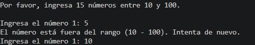
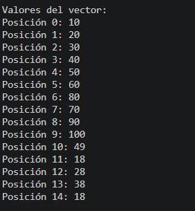
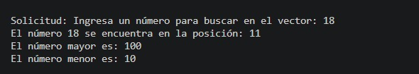
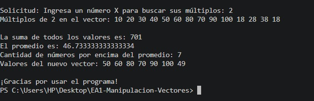

# Proyecto: Manipulación de Vectores en Java

Este proyecto en Java gestiona un vector de 15 números enteros (con rango validado entre 10 y 100).
Realiza operaciones de búsqueda, cálculo de número mayor y menor, suma total, múltiplos y filtrado por encima del promedio.

## Información
* **Lenguaje:** Java
* **Entorno:** VS Code - Eclipse Temurin JDK

## Video de Sustentación
* [https://youtu.be/9FuKinKmPyI?si=IPq36hWtLDYkYiEN](#)

---

## 📸 Evidencia de Funcionamiento del Programa (Capturas de Consola)

Para demostrar la correcta implementación de todos los requerimientos de la actividad, se presenta a continuación la secuencia de ejecución del programa con capturas de pantalla de la consola.

---

### Paso 1: Inicio y Validación de Rango 

La siguiente captura muestra cómo el programa inicia solicitando los 15 números. También se evidencia el funcionamiento del sistema de validación: al ingresar un número inválido (`5`, fuera del rango 10-100), el programa muestra un mensaje de error y vuelve a solicitar el mismo número (Número 1) hasta recibir un valor correcto (`10`).

---

### Paso 2: Llenado y Visualización del Vector

Una vez completado el ingreso de los 15 números válidos, el programa muestra el contenido completo del vector, indicando la posición (índice 0-14) y el valor almacenado en cada una.

---

### Paso 3: Búsqueda y Estadísticas Básicas

En esta parte, se solicita un número para buscar en el vector (`18`). El programa confirma que se encuentra en el vector e indica su posición (`11`). Además, se muestran automáticamente el número mayor (`100`) y el número menor (`10`) detectados durante la ejecución.

---

### Paso 4: Cálculos Finales y Nuevo Vector 

Finalmente, el programa ejecuta las operaciones avanzadas:
1.  **Múltiplos (H):** Se busca el número X (`2`), y el programa lista todos los múltiplos de 2 encontrados en el vector.
2.  **Suma y Promedio (G e I):** Muestra la suma total (`701`) y el promedio exacto (`46.73...`).
3.  **Filtrado (J):** Identifica cuántos números superan el promedio (`7`) y muestra los valores que conforman el nuevo vector filtrado.
4.  **Cierre (K):** El programa finaliza con un mensaje de agradecimiento.

---
